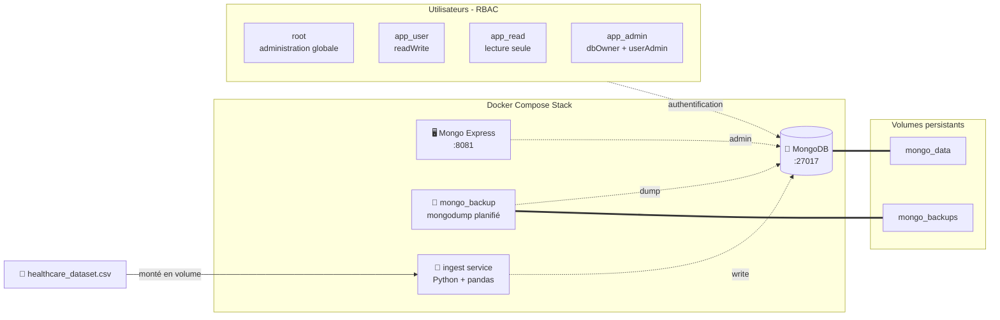

<div align="center">

# 🐳🔐 MongoDB Storage Stack — Conteneurisation sécurisée

### Stack Docker complète pour héberger une base MongoDB de production avec RBAC, ingestion automatisée et sauvegardes — données médicales

[](https://www.python.org/)
[](https://www.mongodb.com/)
[](https://www.docker.com/)
[](https://github.com/mongo-express/mongo-express)
[](LICENSE)

**[Contexte](#-contexte)** • **[Architecture](#%EF%B8%8F-architecture)** • **[Démarrage](#-démarrage-rapide)** • **[Sécurité](#-système-dauthentification--rbac)** • **[Choix de conception](#-choix-de-conception)**

</div>

---

## 📋 Contexte

Conception d'une **stack MongoDB conteneurisée et sécurisée** pour héberger des données médicales sensibles (séjours hospitaliers). Le projet couvre l'ensemble du cycle d'industrialisation d'une base NoSQL :

- **Hébergement** d'une base MongoDB persistante via Docker
- **Interface d'administration** (Mongo Express) pour les opérateurs
- **Service de sauvegarde automatisé** (`mongodump` planifié)
- **Service d'ingestion conteneurisé** (script Python orchestré par Docker Compose)
- **Gestion des volumes** distincts pour données, backups et sources
- **Système d'authentification** complet avec rôles dédiés (RBAC)
- **Documentation** du schéma et des bonnes pratiques

> 🎯 **Objectif** : démontrer qu'un data engineer sait industrialiser une instance MongoDB pour la production, et pas seulement l'utiliser en mode développeur.

---

## 🎯 Objectifs

- ✅ Conteneuriser MongoDB + son outillage (admin UI, backup, ingestion) en **une seule commande**
- ✅ Mettre en place un **RBAC strict** avec 4 rôles distincts (root, app, read-only, admin applicatif)
- ✅ Garantir la **persistance** des données et la **séparation stricte** des responsabilités via volumes Docker
- ✅ Implémenter un **service d'ingestion Python** avec validation et nettoyage des données
- ✅ Documenter le schéma de la base et les bonnes pratiques pour exploitation par une équipe Ops

---

## 🏗️ Architecture



---

## 🛠️ Stack technique

| Composant | Technologie | Rôle |
|-----------|-------------|------|
| **Base NoSQL** | MongoDB 7 | Stockage documents médicaux |
| **Admin UI** | Mongo Express | Interface graphique d'administration |
| **Backup** | mongodump conteneurisé | Sauvegardes automatisées |
| **Ingestion** | Python + pandas | Lecture CSV + validation + insertion |
| **Orchestration** | Docker Compose | Stack reproductible en une commande |
| **OS cible** | Ubuntu 22.04+ | Environnement de référence |

---

## 📊 Schéma de la base de données

Le dataset décrit des **séjours médicaux** (~10 000 entrées). Modèle conceptuel de référence :

### PATIENT
```
- id_patient  
- nom  
- age  
- genre  
- groupe_sanguin  
```

### SEJOUR
```
- id_sejour  
- id_patient  
- date_admission / date_sortie  
- type_admission  
- hopital, medecin, assureur  
- pathologie, medicament, resultats_tests  
- numero_chambre, montant_facture  
```

**Relation** : 1 patient → N séjours

### Modélisation MongoDB implémentée

Document type dans la collection `patients` :

```json
{
  "Name": "Jane Doe",
  "Age": 42,
  "Gender": "Female",
  "Blood Type": "A+",
  "Date of Admission": "2024-01-31",
  "Date of Discharge": "2024-02-02",
  "Admission Type": "Emergency",
  "Hospital": "General Hospital",
  "Doctor": "Dr Smith",
  "Insurance Provider": "HealthCare Inc",
  "Medical Condition": "Fracture",
  "Medication": "Paracetamol",
  "Test Results": "Normal",
  "Room Number": 102,
  "Billing Amount": 1450.90
}
```

**Avantages du modèle document** :
- ✅ Lecture complète d'un dossier patient en une requête (vs N jointures SQL)
- ✅ Modèle adapté nativement au JSON et à MongoDB
- ✅ Ingestion simplifiée depuis le CSV source
- ✅ Structure scalable pour des millions de documents

---

## 🚀 Démarrage rapide

### Prérequis

- Système : Ubuntu 22.04+ (testé), macOS ou Windows avec WSL2
- Docker + Docker Compose

### Installation rapide (Ubuntu)

```bash
sudo apt update
sudo apt install -y docker.io docker-compose-plugin
sudo usermod -aG docker $USER
# Se déconnecter / reconnecter pour appliquer les droits
```

### Configuration

```bash
cp .env.example .env
nano .env   # adapter les credentials
```

> ⚠️ **Ne jamais committer le `.env`**. Le fichier `.env.example` est versionné comme référence.

### Lancement de la stack

```bash
# Démarrage en arrière-plan
docker compose up -d

# Vérification des conteneurs
docker ps
# Services attendus : mongo, mongo_express, mongo_backup, ingest

# Lancer manuellement l'ingestion
docker compose run --rm ingest
```

### Accès

| Service | URL |
|---------|-----|
| MongoDB | `mongodb://localhost:27017` |
| Mongo Express | http://localhost:8081 |

---

## 📁 Structure du projet

```
Mongodb-storage-stack/
├── docker-compose.yml
├── .env.example
├── .gitignore
├── initdb.d/
│   └── 001-init.js                   # Script d'init MongoDB (création users + rôles)
├── MLO_P5_Sources/
│   ├── src/
│   │   ├── config.py
│   │   ├── ingest.py                 # Logique d'ingestion CSV → MongoDB
│   │   ├── transform.py              # Nettoyage et validation
│   │   └── Dockerfile                # Image du service d'ingestion
│   └── Data/CSV/
│       └── healthcare_dataset.csv    # Dataset source
├── backups/                          # Stockage local des sauvegardes
├── MCD BDD.png                       # Modèle conceptuel de la base
└── README.md
```

---

## 🔐 Système d'authentification & RBAC

L'authentification est gérée par MongoDB via le script `initdb.d/001-init.js`, exécuté automatiquement au premier démarrage du container.

### 4 utilisateurs créés automatiquement

| User | Rôle | Usage |
|------|------|-------|
| **`${MONGO_ROOT_USER}`** | `root` | Administration complète, gestion utilisateurs |
| **`${APP_USER}`** | `readWrite` sur `${APP_DB}` | Application principale (ingestion, lecture) |
| **`${APP_READ_USER}`** | `read` uniquement | Connecteurs BI, exports, dashboards |
| **`${APP_ADMIN_USER}`** | `dbOwner` + `userAdmin` | Gestion des index, statistiques, utilisateurs internes |

### Script d'initialisation (extrait `001-init.js`)

```javascript
db.createUser({
  user: process.env.APP_USER,
  pwd: process.env.APP_PWD,
  roles: [{ role: "readWrite", db: process.env.APP_DB }]
});

db.createUser({
  user: process.env.APP_READ_USER,
  pwd: process.env.APP_READ_PWD,
  roles: [{ role: "read", db: process.env.APP_DB }]
});

db.createUser({
  user: process.env.APP_ADMIN_USER,
  pwd: process.env.APP_ADMIN_PWD,
  roles: [{ role: "dbAdmin", db: process.env.APP_DB }]
});
```

### Principes appliqués

- ✅ **Séparation stricte des privilèges** (principle of least privilege)
- ✅ **Protection des données médicales sensibles** (conformité RGPD)
- ✅ **Crédentiels jamais commités** (`.env` en `.gitignore`, `.env.example` versionné)
- ✅ **Génération de mots de passe forts** : `openssl rand -base64 20`

---

## 💾 Volumes et persistance

| Volume | Monté dans | Description |
|--------|-----------|-------------|
| `mongo_data` | `/data/db` | Données persistantes MongoDB |
| `mongo_backups` | `/backups` | Sauvegardes `mongodump` |
| `./MLO_P5_Sources/Data/CSV` | `/data/csv` | Données sources CSV (read-only) |

**Objectif** : persistance garantie même après `docker compose down` + **séparation stricte des responsabilités** (données vs backups vs sources).

---

## 🧠 Choix de conception

### 1. Service d'ingestion Python conteneurisé

```
CSV (Pandas) → Validation (quality()) → Transformation → Insertion MongoDB → Création index
```

**Étapes de validation et transformation** (`transform.py`) :

- Validation du schéma CSV (colonnes attendues vs reçues)
- Conversion des types (dates, numériques, montants, entiers)
- Nettoyage des chaînes (trim, standardisation, case folding)
- Gestion des valeurs incohérentes (âge invalide, montants négatifs, dates impossibles)
- Application de règles métier (genres valides, groupes sanguins connus, montants ≥ 0)
- Suppression des lignes corrompues
- Retour d'un DataFrame propre pour insertion

**Pipeline en full-refresh** : la collection est supprimée puis réinjectée proprement à chaque exécution → garantit la cohérence parfaite entre la source et la base.

### 2. RBAC à 4 niveaux

Au lieu d'un seul utilisateur "tout-puissant", **séparation explicite** des rôles selon les besoins métier. Permet par exemple de donner aux analystes BI un accès `read` sans risque de modification accidentelle des données.

### 3. Mongo Express en option

L'admin UI **Mongo Express** est packagée dans la stack mais accessible uniquement en local (port `8081`). Permet aux opérateurs non-développeurs d'inspecter visuellement la base. **À retirer en production réelle** au profit de MongoDB Compass ou MongoDB Atlas UI.

### 4. Backup conteneurisé

Le service `mongo_backup` exécute `mongodump` à la demande (ou planifié via cron-in-container). Les dumps sont écrits dans le volume `mongo_backups`, isolé du volume `mongo_data` → un crash du volume principal ne corrompt pas les backups.

---

## 🔧 Commandes utiles

```bash
docker compose up -d                      # Démarrer la stack
docker compose down                       # Arrêter (volumes conservés)
docker compose down -v                    # Arrêter + supprimer volumes (⚠️ destructif)
docker compose logs -f mongo              # Suivre les logs MongoDB
docker exec -it mongo mongosh             # Shell MongoDB interactif
docker compose run --rm ingest            # Lancer l'ingestion à la demande
docker compose run --rm backup            # Lancer un backup à la demande
```

---

## 🌱 Aller plus loin (V2)

- 🔐 **TLS/SSL** entre les services Docker (et pas juste auth simple)
- 📅 **Backups planifiés** via cron-in-container ou Kubernetes CronJob
- 🌍 **ReplicaSet** au lieu d'un mongod standalone (HA)
- 📊 **Monitoring** via MongoDB Exporter + Prometheus + Grafana
- 🔄 **CI/CD** : pipeline de validation du schéma + ingestion automatisée sur PR
- 🔒 **Secrets** : passage de `.env` à un vrai gestionnaire (HashiCorp Vault, AWS Secrets Manager)

---

## 👤 Auteur

**Mathieu Lowagie**  
Data Engineer | Service Delivery Manager — 17 ans d'expérience B2B télécoms

🔗 [LinkedIn](https://www.linkedin.com/in/mathieu-pm/) • 💼 [GitHub](https://github.com/Melkia44)

---

## 📄 Licence

Projet réalisé dans le cadre du **Master 2 Data Engineering** (OpenClassrooms — Projet 5 *"Maintenez et documentez un système de stockage des données sécurisé et performant"*).

Distribué sous licence **MIT** — voir [LICENSE](LICENSE) pour les détails.
